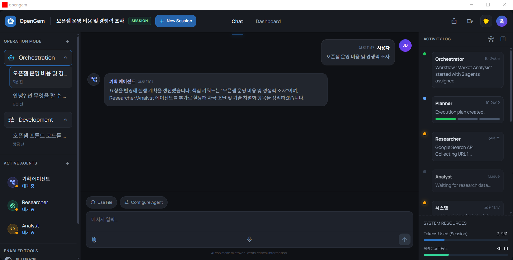
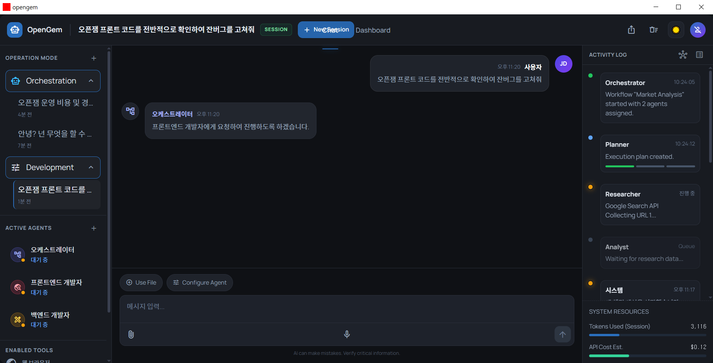

# opengem

`opengem`은 Tauri 2.x + React 19 기반의 데스크톱 AI 에이전트 프로젝트입니다.

## 기술 스택

- Frontend: React 19 + TypeScript + Vite
- Desktop Runtime: Tauri 2 (`src-tauri/src/main.rs`, `src-tauri/Cargo.toml`)
- Language: TypeScript(React), Rust

## 빠른 개발 시작

- 자세한 개발 환경 설정 가이드는 다음 [링크](docs/development-setup.md)를 참고하세요.

- 개발 시에는 기본적으로 `pnpm`을 활용합니다.

### 1. 사전 설치

- `node` 설치: [Node.js 공식 설치 가이드](https://nodejs.org/ko/download)
- `pnpm` 설치:

  ```bash
  npm install -g pnpm
  ```

- `rustc`/`cargo` 설치: [rustup](https://rustup.rs)

- Linux에서 Tauri 실행 시, 아래 시스템 패키지가 필요합니다.

  ```bash
  sudo apt update
  sudo apt install -y build-essential pkg-config libgtk-3-dev libwebkit2gtk-4.1-dev libayatana-appindicator3-dev librsvg2-dev
  ```

### 2. 의존성 설치

```bash
pnpm install
```

### 3. 실행

```bash
pnpm run tauri:dev
```

#### 실행 명령 참고

- `pnpm run dev`: 웹 UI만 개발 시 실행
- `pnpm run tauri:dev`: 데스크톱 앱 실행
- `pnpm run build`: 프론트엔드 빌드 (`dist/`)
- `pnpm run tauri:build`: Tauri 앱 배포 빌드
- `pnpm run preview`: 빌드 결과 미리보기

## UI 미리보기

- 아래 이미지는 현재 데스크톱 UI/UX 화면 예시입니다.

### 메인 화면 1 (일반 모드)



### 메인 화면 2 (개발 모드)


